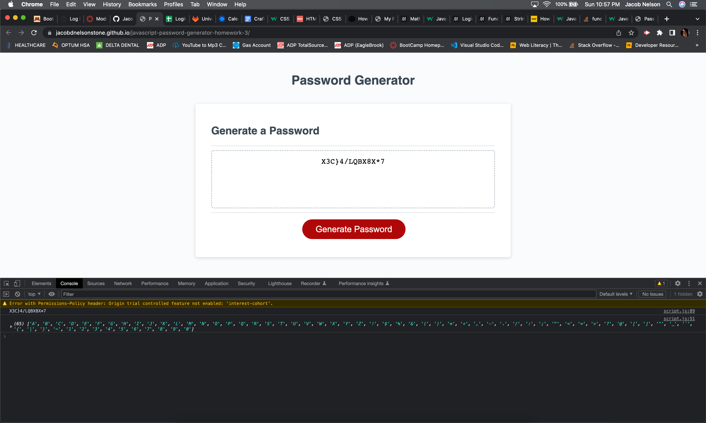

# Homework 3 Javascript Password Generator

* For this homework assignment we were tasked with making a dynamic random password generator usning JavaScript that takes in input from DOM prompts given to the user, which in turn creates an array that the random number generator can pick from and loop the number of times that the user chooses in the password length prompt and then finally return the random password to the user in the text field. 

## Links

[Here's the link to the live site!](https://jacobdnelsonstone.github.io/javascript-password-generator-homework-3/)

